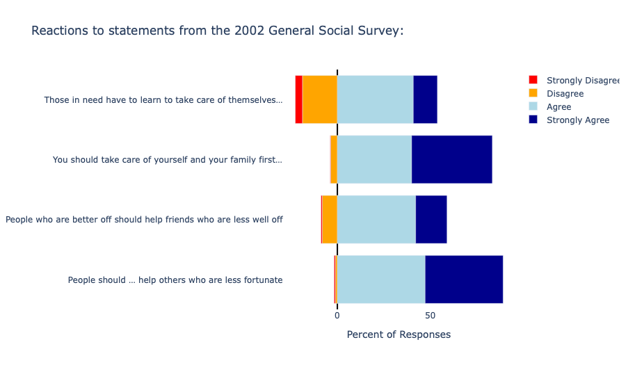

# Survey-Analysis-DB

# 📊 General Social Survey (GSS) Diverging Bar Chart Analysis

This project visualizes Likert-scale responses from the 2002 **General Social Survey (GSS)** using a **diverging bar chart**. The chart design clearly separates **positive** and **negative** sentiments, allowing for quick visual insight into areas of **public agreement or concern**.

---

## 📌 Overview

- The chart shows **positive responses (Agree, Strongly Agree)** to the right of the center (0%).
- **Negative responses (Disagree, Strongly Disagree)** are shown to the left, as **negative values**, creating a diverging effect.
- The **neutral responses are implicit**, allowing viewers to infer neutrality from the distance to 100%.

This approach is commonly used to highlight **public sentiment trends**, making areas of agreement or disagreement visually obvious.

---

## 📈 Output




---

## 🧪 Data Source

Data comes from [Plotly's public datasets](https://github.com/plotly/datasets):

📄 **Dataset URL:**  
[`gss_2002_5_pt_likert.csv`](https://raw.githubusercontent.com/plotly/datasets/refs/heads/master/gss_2002_5_pt_likert.csv)

---

## 🧠 How It Works

### ✔️ Key Concepts

- **Diverging bar charts** split values on either side of zero, making it easy to compare positive vs. negative sentiment.
- **Neutral responses are omitted** from the visualization but can be inferred since all rows sum to 100%.

---

## 🧬 Technologies Used

- 🐍 Python
- 📊 [Plotly Graph Objects](https://plotly.com/python/plotly-express/)
- 🐼 Pandas

---

## 🧩 Code Explanation

```python
# Import libraries
import plotly.graph_objects as go
import pandas as pd

# Load dataset
df = pd.read_csv('https://raw.githubusercontent.com/plotly/datasets/refs/heads/master/gss_2002_5_pt_likert.csv')
df.rename(columns={'Unnamed: 0':"Category"}, inplace=True)

# Invert negative sentiment to appear on left side of chart
for v in ["Disagree","Strongly Disagree"]:
    df[v] = df[v] * -1

📉 Add Traces to the Diverging Bar Chart

# Define custom colors
color_by_category = {
    "Strongly Agree": 'darkblue',
    "Agree": 'lightblue',
    "Disagree": 'orange',
    "Strongly Disagree": 'red',
}

# Define legend order
legend_rank_by_category = {
    "Strongly Disagree": 1,
    "Disagree": 2,
    "Agree": 3,
    "Strongly Agree": 4,
}

# Add bars for each Likert response
for col in ["Disagree", "Strongly Disagree", "Agree", "Strongly Agree"]:
    fig.add_trace(go.Bar(
        y=df["Category"],
        x=df[col],
        name=col,
        orientation='h',
        marker=dict(color=color_by_category[col]),
        legendrank=legend_rank_by_category[col]
    ))

🎨 Layout Configuration

fig.update_layout(
    title="Reactions to statements from the 2002 General Social Survey:",
    yaxis_title="",
    barmode='relative',
    plot_bgcolor="white"
)

fig.update_xaxes(
    title="Percent of Responses",
    zeroline=True,
    zerolinecolor="black",
    tickmode='array',
    tickvals=[-50, 0, 50, 100],
    ticktext=[50, 0, 50, 100]
)

fig.show()

